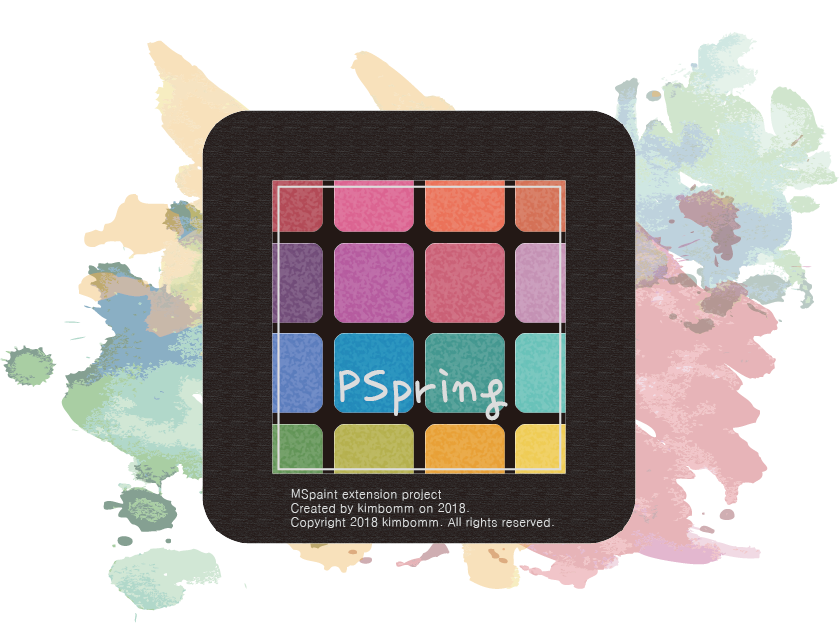
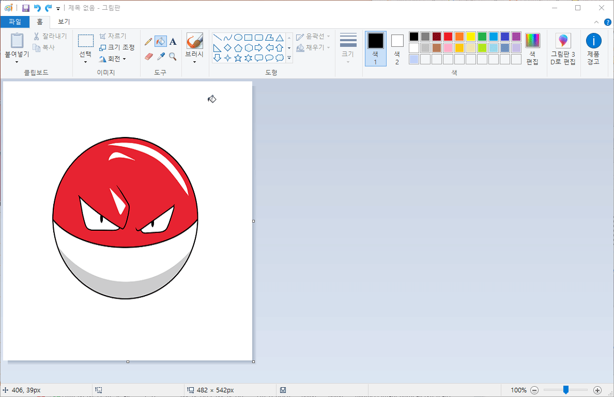

##   PSpring

##### mspaint extension program.
 

Mspaint has two main problems. There is no rotation method and color memorization.
This PSpring project provides these two method extensions to mspaint.

### Example

### Install

Download below program and allow run on yout PC.

[pspringinstaller.exe](https://github.com/springkim/PSpring/releases/download/1.0/pspringinstaller.exe)
